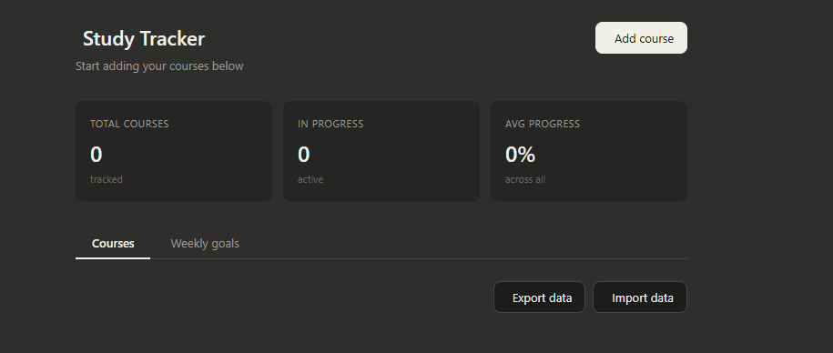

# 📚 Study Tracker

A personal study tracker that runs entirely in your browser, no server, no install, no account needed.

Track your courses from Coursera, Udemy, edX, YouTube, and more. Set weekly hour goals, log progress, and keep notes. All saved locally to your browser.



## Features

- **Add courses** from any platform (Coursera, Udemy, edX, YouTube, LinkedIn Learning, etc.)
- **Track progress** by percentage and by modules completed (e.g. 3 / 12)
- **Set weekly hour goals** and log how much you study each week
- **Deadlines** with visual warnings when due soon or overdue
- **Notes per course** - inline, editable, always there
- **Export / Import** your data as JSON - back it up or move it between devices
- **Dark mode** supported automatically via your OS preference
- **Persists across sessions** using browser localStorage

## Usage

1. Download or clone this repo
2. Open `index.html` in any modern browser
3. Start adding your courses!

No build step. No dependencies to install. Just one HTML file.

## Running locally

```bash
git clone https://github.com/your-username/study-tracker.git
cd study-tracker
open index.html   # macOS
# or just double-click index.html on Windows/Linux
```

If you want a local dev server (optional):

```bash
npx serve .
# then visit http://localhost:3000
```

## Running with Docker

The app is served by a lightweight Nginx container.

**With Docker Compose (recommended):**

```bash
docker compose up --build
# then visit http://localhost:8080
```

**With plain Docker:**

```bash
docker build -t study-tracker .
docker run -p 8080:80 study-tracker
# then visit http://localhost:8080
```

To stop: `docker compose down` (or `Ctrl+C`).

> **Note on data:** `localStorage` is tied to your browser, not the container — so your courses persist across restarts as long as you use the same browser and URL.

## Data & Privacy

All data is stored in your browser's `localStorage`. Nothing is sent anywhere. To back up your data, use the **Export data** button — it saves a `.json` file you can re-import anytime.

## Customisation ideas

- Add a `categories` or `tags` field per course
- Add a streak counter for daily study sessions
- Add a chart showing progress over time
- Integrate with a Pomodoro timer

## Project structure

```
study-tracker/
├── index.html          # The entire app — HTML, CSS, and JS in one file
├── Dockerfile          # Nginx Alpine image to serve the app
├── docker-compose.yml  # Easy local run with `docker compose up`
├── .dockerignore
└── README.md
```
